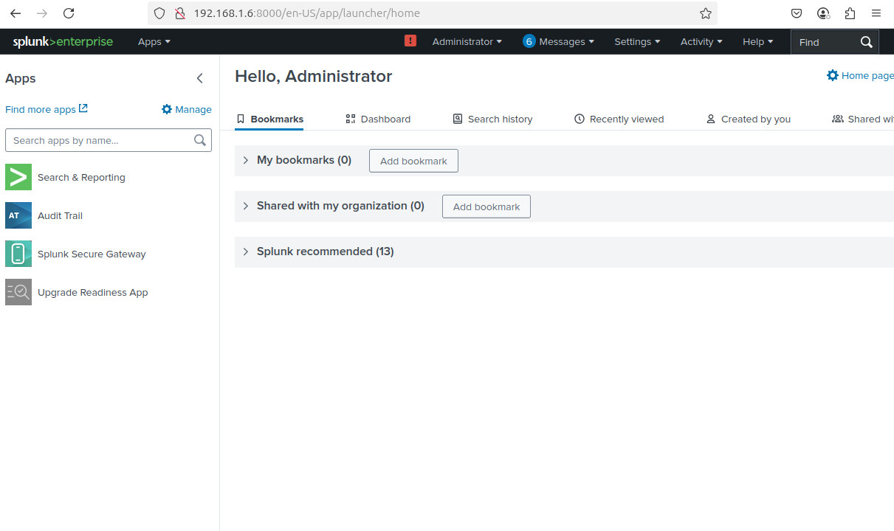
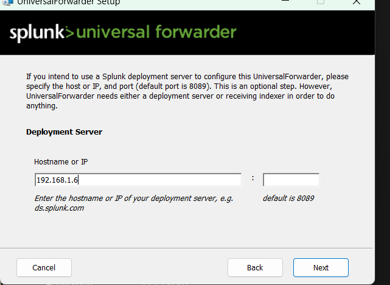

# 🧪 Mini SOC Lab – Splunk Setup Guide

This guide documents the setup of **Splunk Enterprise** on an Ubuntu server and **Splunk Universal Forwarder** on a Windows machine as part of a mini SOC (Security Operations Center) lab.

---

## 🟢 Splunk Enterprise Setup (Ubuntu Server)

1. **Download Splunk Enterprise**  
   👉 [Download Link](https://www.splunk.com/en_us/download/splunk-enterprise.html)

2. **Install Splunk**  
   Replace `9.4.3` with the version you downloaded:
   ```bash
   sudo tar -xvzf splunk-9.4.3-*.tgz -C /opt
   sudo /opt/splunk/bin/splunk start --accept-license
   ```

3. **Set up Admin Credentials**  
   When prompted, create a username and password for the Splunk Web UI.

4. **Access Splunk Web Interface**  
   Open your browser and visit:
   ```
   http://localhost:8000
   ```
   or use the server's IP if accessing remotely.

5. **Enable Data Receiving on Port 9997**  
   From the Splunk CLI:
   ```bash
   sudo /opt/splunk/bin/splunk enable listen 9997
   sudo /opt/splunk/bin/splunk restart
   ```

---

## 🟦 Splunk Universal Forwarder Setup (Windows Machine)

1. **Download the Universal Forwarder**  
   👉 [Download Link](https://www.splunk.com/en_us/download/universal-forwarder.html)

2. **Install the Forwarder**
   - Run the `.msi` installer.
   - During setup, choose to connect to a deployment server (optional).
   - Enter the **IP address of your Splunk Enterprise server** (find it with `ip a` on Linux).

3. **Configure Receiving Indexer**
   - Use the Splunk server's IP and port `9997` as the destination.

4. **Verify Forwarder Connection**
   In Command Prompt:
   ```cmd
   cd "C:\Program Files\SplunkUniversalForwarder\bin"
   splunk list forward-server
   ```
   If successful, it should say:
   ```
   Active forwards:
       192.168.1.X:9997
   ```

---

## 📸 Optional: Add Proof Screenshots

Place screenshots in a `screenshots/` folder and embed them:

```markdown


```

---

## ✅ Final Notes

- Ensure both machines are on the same network.
- Allow port `9997` through any firewalls.
- You can search logs in Splunk Web using:
  ```spl
  index=* host=*
  ```

---

**Author**: [Your Name]  
**Repo**: `mini-soc-lab`  
🔐 Learn more at [docs.splunk.com](https://docs.splunk.com)
